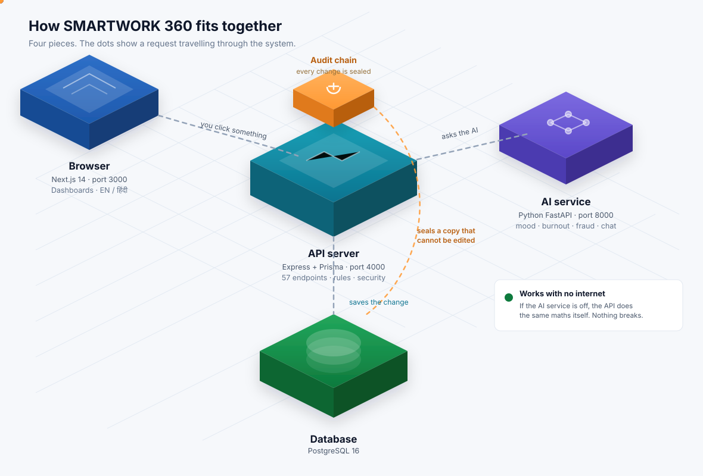
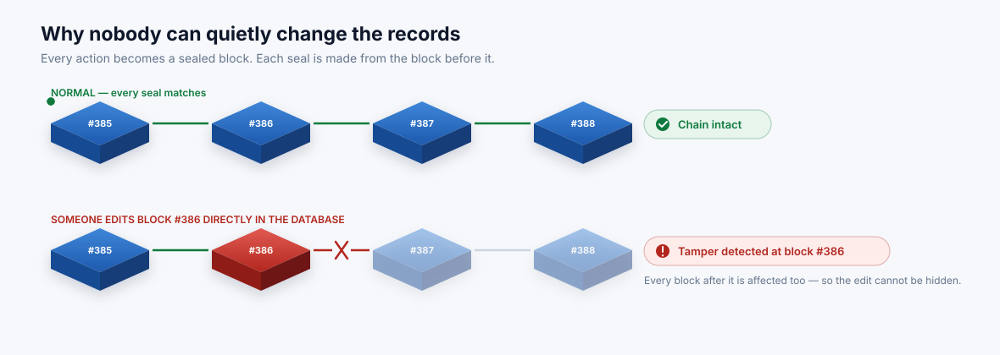

<p align="center">
  
</p>

<p align="center">
  
</p>

<p align="center">
  
  
  
  
  
  
</p>

---

## What problem does this solve?

In a government office, work moves on paper and phone calls. A file sits on
somebody's desk and nobody knows. A deadline passes and nobody notices until a
citizen complains. When something goes wrong, there is no reliable way to find out
who changed what, or when.

**SMARTWORK 360 fixes three things:**

| Problem today | What this does |
|---|---|
| Nobody knows where a file is stuck | Live dashboards for staff, managers and the collector |
| Deadlines slip quietly | Automatic SLA countdown, warnings before a deadline is missed |
| Records can be changed without a trace | Every change is sealed in a chain that shows if anyone edited it |
| Nobody notices when staff are drowning | The system spots overload and low morale from the work itself |

---

## See it in 60 seconds

```bash
docker compose up -d     # start the database (skip if postgres already runs)
npm install              # install everything
npm run seed             # fill it with a realistic district office
npm run dev              # open http://localhost:3000
```

Click a role on the login screen — no password typing needed.
**Every demo account uses the password `Demo@123`.**

| Sign in as | Email | What you see |
|---|---|---|
| 👑 **Collector (Admin)** | `rajesh.iyer@gov.in` | Every department, fraud alerts, the audit chain |
| 👔 **Manager** | `anil.kulkarni@gov.in` | One department's team, workload and morale |
| 👤 **Employee** | `kavita.joshi@gov.in` | Only her own tasks |

---

## How it fits together

<p align="center">
  
</p>

Four pieces, in plain terms:

1. **Browser** — what people see. Dashboards, task lists, charts. Switches between
   English and हिंदी instantly.
2. **API server** — the rulebook. It decides who may see what, whether a task is
   allowed to move to the next stage, and it saves everything.
3. **Audit chain** — a sealed copy of every change. Explained below.
4. **AI service** — reads the notes people write and works out mood, overload and
   suspicious behaviour.

> **It keeps working with no internet.** If the AI service is switched off, the API
> does the same calculations itself. Nothing on screen breaks or goes blank.

---

## The part judges ask about: can records be faked?

<p align="center">
  
</p>

Every action — creating a task, approving it, adding a note — becomes a **block**.
Each block carries a fingerprint made from *the block before it*.

So if somebody opens the database and edits one old record, its fingerprint no
longer matches, **and every block after it stops matching too**. The change cannot
be hidden.

**Try to break it yourself:**

```bash
npm run demo:tamper     # secretly edits one record, straight in the database
```

Now open **Blockchain Audit** in the app and press **Verify chain**. The screen turns
red and names the exact block that was touched. The row still looks completely normal
in the database — only recomputing the chain reveals it.

```bash
npm run demo:reset      # put everything back
```

Measured: **962 blocks checked in 15 milliseconds.**

> **Being straight with you:** this is not a public blockchain and we never say it
> is. It is a sealed chain of fingerprints stored in an ordinary database, plus
> checkpoints every 100 blocks. Publishing those checkpoints to a real chain is
> designed but *not* built, and the screen says **"planned"** where that would go.

---

## What the AI actually does

No chatbot pretending to be clever. Four specific jobs, each measured.

### 1. Reads the mood of the office
It scores the notes staff write — including Hinglish like *"delay ho raha hai"* —
and shows the team's morale as a dial.

**We tested a famous AI model against our own simpler method and the simple one won:**

| Method | Accuracy on unseen notes |
|---|---|
| ✅ **Our word-based method (shipped)** | **87.5%** |
| DistilBERT AI model, helped along | 85.0% |
| DistilBERT AI model on its own | 65.0% |

The AI model was trained on *movie reviews* and only knows "good" or "bad". Most
lines in a government file are neither — *"Placed the muster roll before the accounts
branch"* is just routine, and the model called it negative. So we shipped the method
that actually works here, and we show the numbers rather than hide them.

### 2. Spots staff who are drowning
From workload, missed deadlines, late-night working and the tone of their own notes.
In the demo data it flags **Ramesh Patel at 85/100 — critical**, before anybody
complained.

### 3. Spots suspicious behaviour
It reads the **audit chain**, not the task list — because somebody who edits a record
cannot edit the evidence that they edited it. In the demo it catches an officer who
approved his own work and closed a field inspection in 4 minutes.

**92% precision** — 11 of 12 flagged cases were genuine on review. Not 100%, because
one was a real false alarm: a man working late who turned out to be overloaded, not
dishonest. We label it as a miss instead of quietly deleting it.

### 4. Answers questions about your work
Ask *"mere pending kaam kitne hain?"* and it answers from your real tasks. It
**cannot make up a number**, because it never writes numbers — it picks the answer
shape and fills in figures straight from the database.

---

## Everything else it does

- **Works in Hindi.** One click swaps the whole interface. Task text stays as
  written — translating a citizen's file note would misrepresent the record.
- **New staff can register themselves.** Sign up → verify by email code → an
  administrator approves → you're in. Self-registration can only ever create a
  normal employee account, never a manager.
- **Nobody approves their own work.** The system blocks it, whatever your rank.
- **Drag-and-drop task board** for managers, with illegal moves refused.
- **Reports** you can download as spreadsheets.
- **Works on a phone** and installs like an app.
- **Built for accessibility** — full keyboard use, screen-reader labels, and all
  animation switches off if your device asks for reduced motion.

---

## Honest scorecard

Every number below was measured on the demo data and is shown live in the app, not
typed into a slide.

| Claim | Measured | Where to check |
|---|---|---|
| Work gets done 30–40% faster | **32.5%** | Org Overview, top-right card |
| Mood detection is 85–90% accurate | **87.5%** | `npm run eval:ml` |
| Fraud detection ~92% precise | **11 of 12** | Fraud & Risk Center |
| Records are tamper-evident | **962 blocks, 15 ms** | Blockchain Audit → Verify |
| 30+ documented APIs | **66** | <http://localhost:4000/docs> |

**What is simulated, stated plainly:**

- The **Parichay** government login screen is a *practice version*. The real one needs
  official NIC approval. Every screen says **Sandbox**.
- **Blockchain anchoring** is designed, not built. No cryptocurrency, no wallet, no
  transaction.
- The AI runs offline by default so a demo cannot fail on bad wifi.

---

## Built with

| Layer | Technology |
|---|---|
| Website | Next.js 14, TypeScript, Tailwind CSS, Framer Motion |
| Server | Node.js, Express, Prisma, PostgreSQL 16 |
| AI | Python, FastAPI, scikit-learn, DistilBERT |
| Security | SHA-256 hash chain, JWT sign-in, bcrypt passwords |

---

## More reading

| File | What's in it |
|---|---|
| **[DEMO.md](DEMO.md)** | A rehearsed 7-minute script for showing this to judges |
| **[TECHNICAL.md](TECHNICAL.md)** | Full technical reference — API, models, evaluation method |
| **[DECISIONS.md](DECISIONS.md)** | Every engineering decision and *why*, including the mistakes |

---

<p align="center">
  <sub>Smart India Hackathon prototype · Aligned with the Digital India initiative</sub><br>
  <sub>The circular emblem is a generic departmental monogram. The State Emblem of India is deliberately not used — its use is restricted by law.</sub>
</p>
