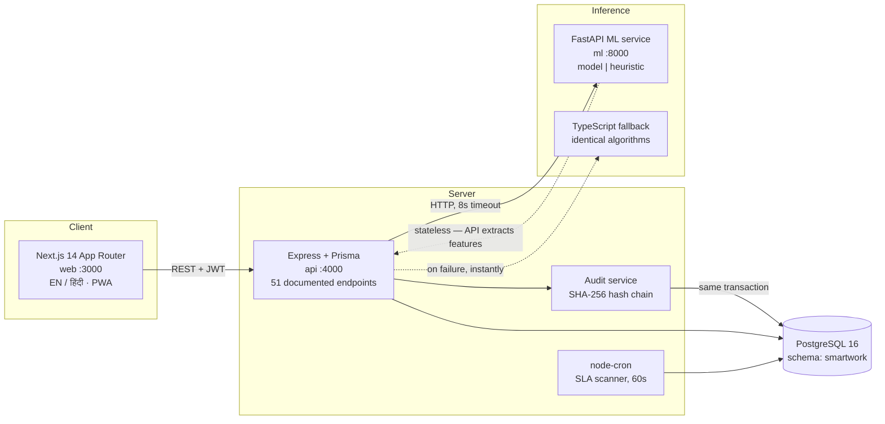

# SMARTWORK 360

**AI + Blockchain-backed Smart Task & Performance Management System for Government Offices**

A Smart India Hackathon prototype. It replaces manual follow-ups and opaque reporting
in government departments with role-based dashboards (Admin / Manager / Employee),
AI-driven insight into morale, burnout and anomalous behaviour, and a tamper-evident
SHA-256 hash-chain audit trail over every state change.

> Every headline number in this README was measured on the seeded dataset and is
> displayed live in the product. Where something is simulated — the Parichay SSO
> screen, blockchain anchoring — it is labelled as simulated in the UI, in the API
> response, and here.

---

## Quickstart

```bash
docker compose up -d     # PostgreSQL 16 — skip if you already run postgres on :5432
npm install              # installs all four workspaces
npm run seed             # schema + a realistic 90-day district-office history
npm run dev              # web :3000 · api :4000
npm run dev:ml           # optional — FastAPI ML service on :8000
```

Open <http://localhost:3000>. The login screen has one-click chips for each role.
**Password for every demo account: `Demo@123`.**

| Role | Account | Sees |
|---|---|---|
| Admin | `rajesh.iyer@gov.in` | Everything, all departments |
| Manager | `anil.kulkarni@gov.in` | Public Works only (the burnout case lives here) |
| Manager | `sunita.deshmukh@gov.in` | Revenue only (the fraud case lives here) |
| Employee | `kavita.joshi@gov.in` | Only her own tasks |

Other useful commands:

```bash
npm run demo:tamper   # simulate an insider editing the database directly
npm run demo:reset    # restore the chain and re-seed
npm run eval:ml       # sentiment accuracy on the held-out corpus
npm run typecheck     # strict TypeScript across all workspaces
```

**`DEMO.md` is the rehearsed 7-minute judge script.** `DECISIONS.md` logs every
non-obvious engineering decision with its reasoning.

---

## Architecture



```
apps/web         Next.js 14 App Router — all three role dashboards
apps/api         Express + Prisma REST API, Swagger at /docs
services/ml      Python FastAPI — sentiment, burnout, anomaly, chat intents
packages/shared  Shared TypeScript types, zod schemas, workflow rules
```

Ports: web `3000`, api `4000`, ml `8000`, postgres `5432`.

### The three architectural commitments

**1. Nothing is written without being audited.** `appendEvent()` takes the caller's
Prisma transaction. A task change and its audit block commit together or roll back
together — there is no code path that produces an unaudited mutation.

**2. Access control lives in the query, not the UI.** `middleware/scope.ts` returns
Prisma `where` fragments. A hand-crafted request from a manager cannot read another
department's rows, because the filter is in the SQL.

**3. The demo cannot break offline.** The ML service defaults to heuristic mode. If
it is unreachable, the API falls back to TypeScript implementations of the same
algorithms — verified to produce byte-identical sentiment scores across all 130
evaluation comments. Fonts are self-hosted npm packages; no runtime CDN calls.

---

## The audit chain

Every mutation appends a block:

```
hash = sha256(
  prevHash | chainIndex | entityType | entityId | action | actorId |
  canonicalJson(payload) | createdAtISO
)
```

- **Genesis** block has `prevHash = "0".repeat(64)`.
- `canonicalJson` sorts object keys before hashing — Postgres `jsonb` does not
  preserve key order, so a payload read back would otherwise hash differently than
  when written.
- `createdAt` is generated in the service, not by a database default, because it is
  part of the hash pre-image.
- `verifyChain()` streams every block in one query and checks three things: the
  index is dense (catches deletion), `prevHash` matches (catches reordering), and
  the contents reproduce the stored hash (catches editing). It reports the **first**
  failing index.
- A **Merkle root** is cut every 100 blocks into an `anchors` table.
  `externalTxHash` reads `pending — Polygon Amoy (planned)`. **No chain call is ever
  made.** Anchoring is designed, not claimed.

Measured: **962 blocks verified in 15ms.**

### Try to break it

```bash
npm run demo:tamper
```

Runs a raw `UPDATE` against `smartwork.audit_events`, bypassing the audit service
entirely — no new block, no recomputed hash. The row looks perfectly normal in
`psql`. Then press **Verify chain** in the Admin → Blockchain Audit screen: the
banner turns red, names the broken block, and the linked-block strip scrolls to the
severed link with every subsequent block faded, because the break propagates.

`npm run demo:reset` restores it. User and department IDs are deterministic, so a
reset does **not** sign you out mid-demonstration.

---

## What the AI actually does

### Sentiment — and why the lexicon beats the transformer here

| Path | Held-out accuracy (40 comments) |
|---|---|
| **Heuristic lexicon (shipped default)** | **87.5%** |
| DistilBERT SST-2 + neutrality gate | 85.0% |
| DistilBERT SST-2 alone | 65.0% |

DistilBERT SST-2 reports ~91.3% on the SST-2 dev split — English **movie reviews**,
and a **binary** task with no NEUTRAL class. Most lines in a government file are
neither praise nor complaint. On our held-out set its NEUTRAL recall was **0.08**:
*"Placed the muster roll before the accounts branch for scrutiny"* came back
NEGATIVE with high confidence.

We added a **neutrality gate** — the lexicon answers *"does this text carry any
affect at all?"*, which is the question a binary classifier structurally cannot —
and model mode went from 65% to 85%. The lexicon still edges it, needs no 250MB
download, and cannot break offline, so it ships as the default.

**Evaluation methodology.** Three corpora, each retired from the headline the moment
it influences a change:

| File | Size | Role |
|---|---|---|
| `office_comments_dev.csv` | 50 | Weights tuned on it — 98%, meaningless as an estimate |
| `office_comments_test.csv` | 40 | Its errors prompted a vocabulary sweep — 95%, no longer clean |
| `office_comments_holdout.csv` | 40 | Written after tuning stopped — **87.5%, the reported figure** |

The first set reached 100% at one point. That was the signal to build the second and
third: quoting accuracy on data that shaped the model is fitting to the test set.

```bash
npm run eval:ml
```

### Burnout

Five features over 14 days — active load, overdue count, after-hours share, negative
sentiment share, update frequency. The API extracts them; the service scores them.

The model card says plainly what this is: there is no public corpus of
government-office burnout labels, so the LogisticRegression is trained on synthetic
vectors generated from an expert-specified weighting. It is a **calibrated version of
a documented rule**, not a discovery from real workforce data.

### Anomaly detection

Feature vectors are built from the **audit chain**, not the task table — a user who
edits a record cannot edit the evidence of having edited it. IsolationForest is
fitted on the incoming batch *plus a synthetic normal-staff cohort*, so a department
where several people misbehave cannot redefine "normal".

Reason tags (`night_hour_ratio`, `self_approval`, `cycle_time_zscore`…) are
rule-derived in **both** modes, because the Fraud Center shows them as the evidence a
reviewer acts on — that explanation must not change with the inference mode.

On the seeded data the detector independently scores the planted fraud case at
**0.990**, against ≤0.18 for every other user.

### The assistant

An **intent router**, not a generator. It classifies the question — in English,
Hindi or Hinglish — then fills a template from figures the API fetched. It cannot
hallucinate a task count because it never produces one. An unrecognised question
returns the capability list rather than a plausible-sounding guess.

---

## Claimed metrics, and where to check them

| Claim | Measured | Where |
|---|---|---|
| 30–40% faster workflow execution | **32.5%** | Org Overview KPI. Mean cycle time, older half of completed tasks vs recent half. Computed per request. |
| 85–90% sentiment accuracy | **87.5%** | `npm run eval:ml`, held-out corpus |
| ~92% fraud detection precision | **11/12 = 92%** | Fraud & Risk Center. Labelled evaluation set only — runtime alerts are unlabelled and excluded so the figure cannot drift upward. |
| 100% tamper-evident audit trail | 962 blocks, 15ms | `GET /audit/verify`, plus the tamper demo |
| 30+ documented REST APIs | **51 operations** | <http://localhost:4000/docs> |

---

## API

Swagger UI at **<http://localhost:4000/docs>** — generated from JSDoc beside each
route, so it cannot drift from the implementation. Sign in via `POST /auth/login`,
click **Authorize**, paste the `accessToken`.

| Tag | Ops | Notable |
|---|---|---|
| Auth | 5 | Password, refresh, and the labelled Parichay sandbox |
| Tasks | 9 | Lifecycle with enforced transitions and maker-checker separation |
| Users | 5 | Directory plus per-user performance |
| Departments | 5 | CRUD plus SLA policy editing |
| Fraud | 5 | Alerts, triage, scan, precision, scatter |
| Audit | 4 | Events, **verify**, entity history, Merkle anchors |
| Analytics | 4 | KPIs, SLA, trends, workload |
| Sentiment / Burnout | 6 | Team views and recompute |
| Notifications / Reports / Chat | 8 | Bell feed, CSV exports, assistant |

**Maker-checker separation** is enforced in the service on *both* paths that can
reach `COMPLETED` (`/status` and `/review`): you cannot approve a task assigned to
you, whatever your role.

---

## Design — "GovTrust UI"

A modern layer over NIC e-Office conventions: sober, data-dense, government-identity
aware. Primary navy `#14417B`, dark sidebar `#0E2A52`, saffron `#FF9933` used for
accents and active indicators **only** — never as body text on white, where it fails
contrast. Light theme only, which is what survives a projector.

- **WCAG 2.1 AA** — visible focus rings, keyboard-navigable tables and kanban,
  aria-labels on icon buttons, skip-to-content link, `aria-live` on the verification
  banner.
- **Bilingual** — instant EN ⇄ हिंदी across navigation, KPI labels, status chips and
  breadcrumbs. Task content stays as authored; translating a citizen's file note
  would misrepresent the record. Missing a Hindi key is a **compile error**, not a
  blank label found on stage.
- Self-hosted Inter + Noto Sans Devanagari via `@fontsource` — `next/font/google`
  fetches at build time and would fail an offline build.
- Skeletons on every fetch, empty states with a next action, error states with retry.

The sidebar mark is a generic circular "GoI" monogram. The **State Emblem of India is
deliberately not used** — its use is restricted by law.

---

## Seeded data

Deterministic (fixed-seed PRNG), so the demo is identical on stage and in rehearsal:
4 departments, 25 users, ~160 tasks over 90 days, ~380 updates, ~960 audit blocks.
Content is hand-authored rather than faker-generated — faker's Indian locale produces
name/designation/task combinations that read as fake to anyone who has seen a
district office.

Three patterns are planted deliberately and marked `PLANTED` in `prisma/seed.ts`:

- **Burnout** — Ramesh Patel (Public Works): 14 active tasks, 6 overdue, after-hours
  updates, rising negative sentiment → surfaces at **85/100, CRITICAL**.
- **Fraud** — Vikas Meena (Revenue): 14 status changes inside two single-hour
  night-time bursts, 3 self-approvals, one task closed in **4 minutes**.
- **SLA story** — Health department breach cluster, recovering afterwards, so the
  trend charts and the heatmap narrate a real improvement.

---

## Non-goals

Stated so nobody has to guess what is real:

- **No real Parichay/NIC integration.** The screen is labelled Sandbox everywhere.
- **No blockchain transactions.** Merkle roots are computed; anchoring is planned.
- No Flutter app, no cloud file uploads, no email, no WebSockets (dashboards poll
  every 30s), no multi-tenancy, no dark mode.

## Environment notes

- **Node 20+.** Built and verified on Node 25.
- **Python 3.11–3.13 for ML model mode.** Core ML requirements are unpinned and
  install on 3.14, but `torch` and `pydantic-core` have no 3.14 wheels — heuristic
  mode (the default) works on any interpreter.
- Prisma targets a dedicated `smartwork` schema, so it will not collide with
  anything already in a database of the same name.
- Copy `.env.example` to `.env` in `apps/api`, `apps/web` (`.env.local`) and
  `services/ml` if you need to change defaults; the defaults work as-is.
